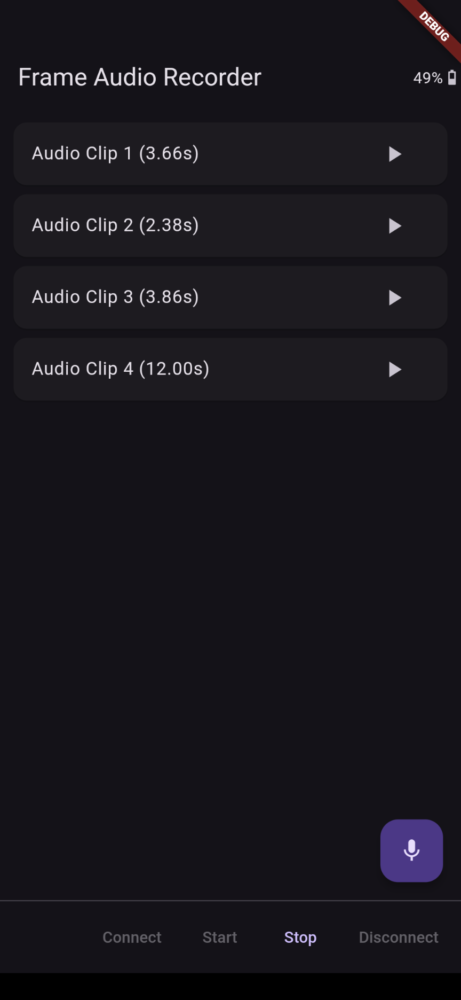

# Frame Audio Clip Recorder and Playback (LC3)

Record streamed audio clips from the Brilliant Labs Frame into a list for review and playback and Sharing.

Audio is recorded at 8kHz, 16-bit and streamed back as LC3 10ms frames in real-time so long recordings (that would exceed device memory) are possible.

LC3 codec is provided by [liblc3](https://github.com/google/liblc3)
The C code is built from source in the app, so a native build chain for the target platform is required.

Playback on mobile uses the `raw_sound` Flutter package (in fact a fork of the original package due to build/version issues with the original).

Sharing uses the `share_plus` Flutter package.

Very short clips (< 256ms) can be recorded but won't be played since `raw_sound` doesn't seem to play clips shorter than its buffer size (4096 bytes) on Android, at least.

### Screenshots

