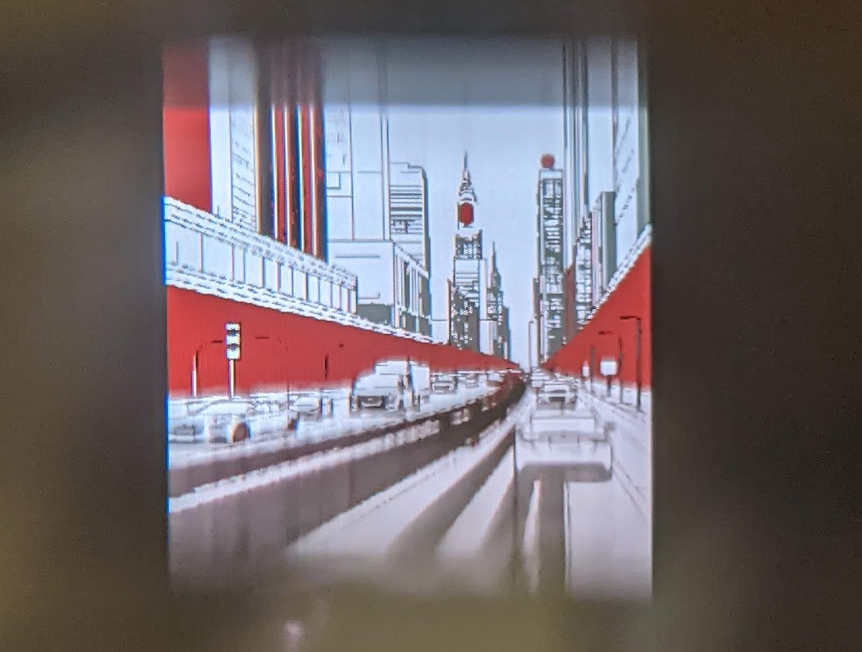
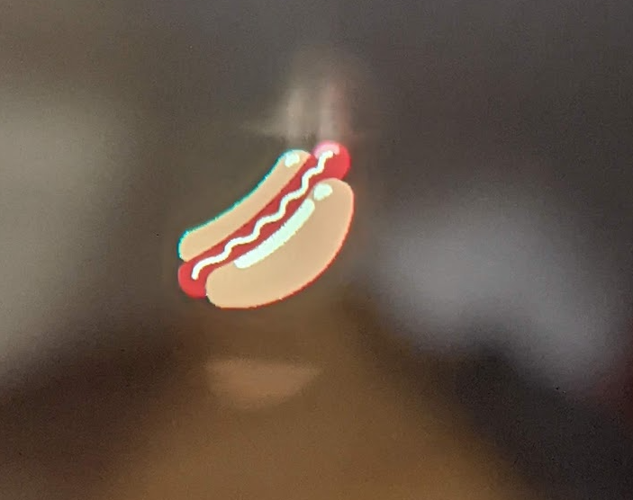

# Sprite Viewer

Basic image and sprite viewer for Brilliant Labs Halo and Frame.

## Frameshots
1-bit sprite

2-bit sprite

4-bit sprite

## Instructions

* Connect to Frame and start the application. Using the file picker, choose a 1-bit, 2-bit or 4-bit indexed (palette) PNG file from your device. Sample sprites of each type are included in the assets/ directory, which you can download to your device.
* Update: other image file types are now supported (any that can be decoded by the Flutter `image` package)
* Ensure uncompressed size (width * height * bits-per-pixel / 8) is less than about 25kB for Frame.
* Tools such as [LibreSprite](https://libresprite.github.io/) are useful for creating 1-, 2- and 4-bit images in the required palettes.